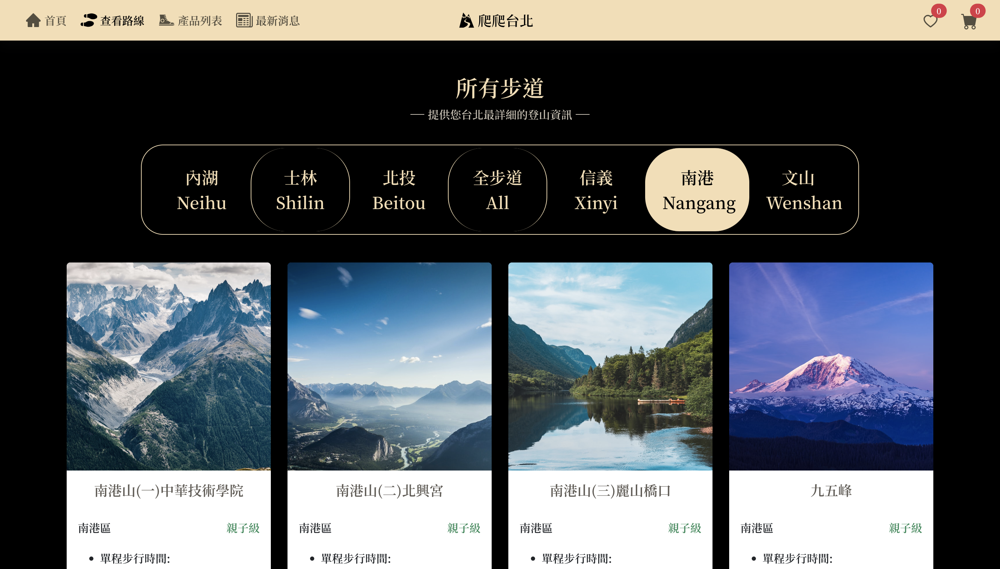
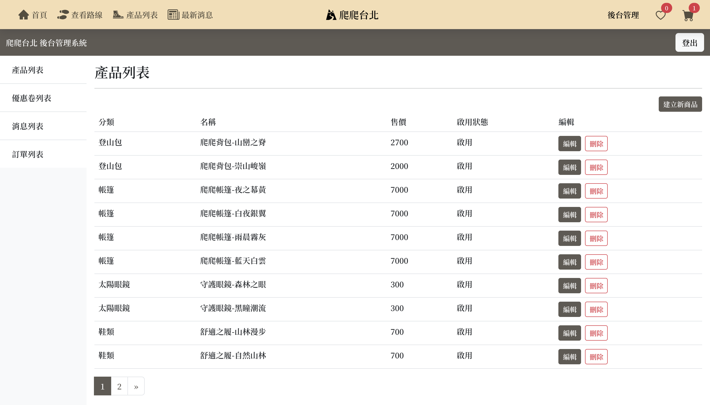

# 爬爬台北 Mounting Taipei

裝置: 手機 / 平板 / 桌機

「爬爬台北 Mounting Taipei」是提供台北市登山步道資訊檢索，以及登山用品販售的品牌官網  
連結：[https://earnest-zabaione-a4024c.netlify.app/](https://earnest-zabaione-a4024c.netlify.app/)

## 關於爬爬台北

1.使用 React 與 Hook 開發網頁功能與架構  
2.使用 Context 與 Reducer 管理狀態  
3.Bootstrap 5 / SCSS 完成 Web Layout  
4.Axios 串接 Unsplash API 完成步道圖片顯示

## 開發技術

-React  
-React-Router-DOM  
-React Hook Form  
-Bootstrap 5  
-Swiper  
-Axios  
-react-loading  
-AOS  
-react-icons
